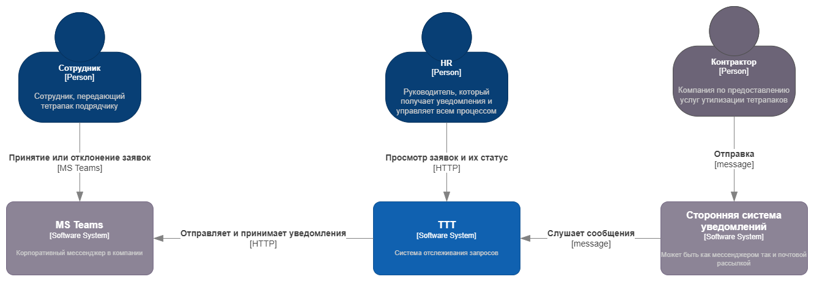
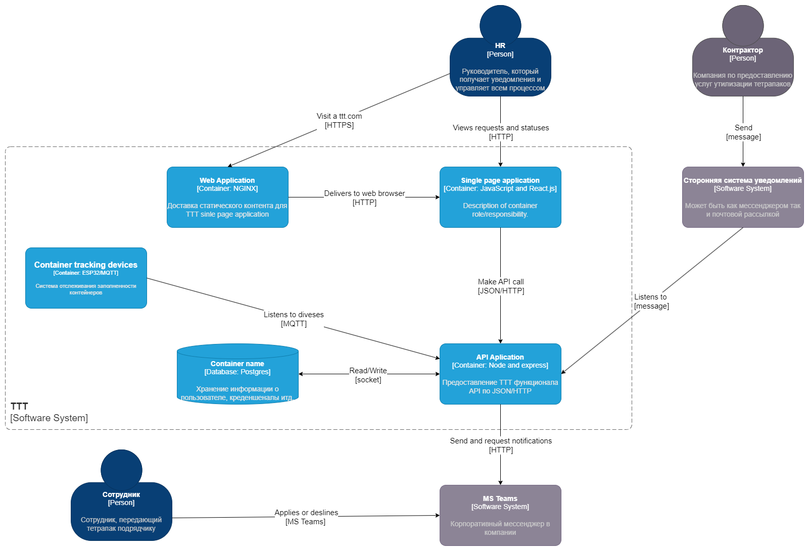
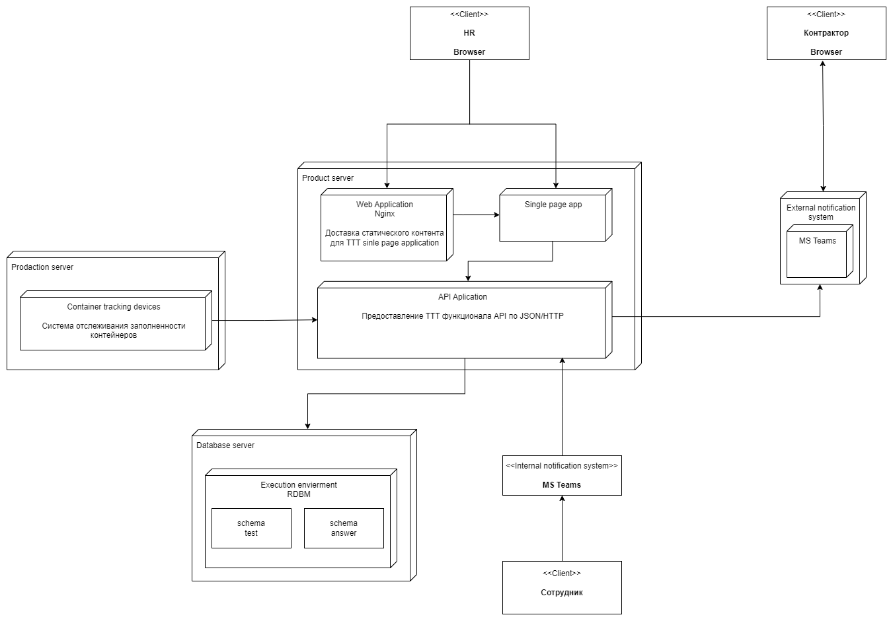
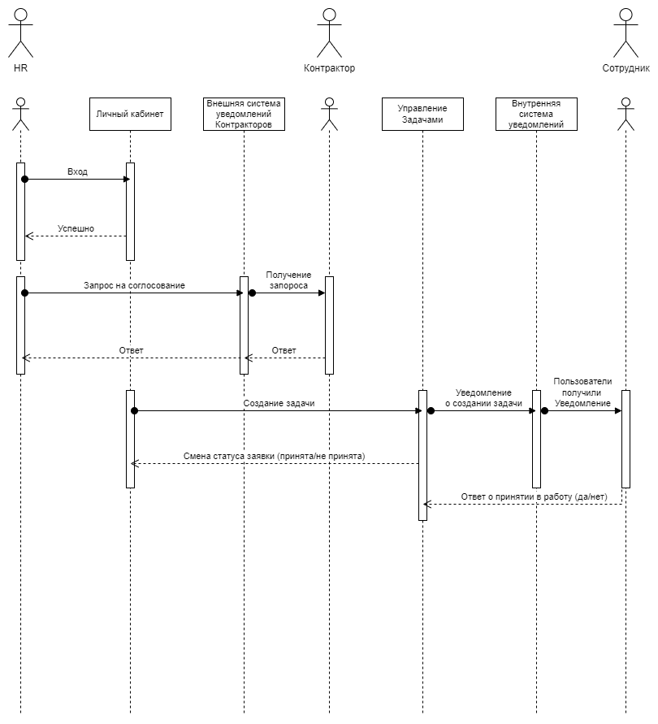

# Финальный проект

## Описание проблемы

### Контекст
    В компании HR отдел сильно задействован в процессе по вывозу тетрапаков из офиса, HR отдел координирует работу контракторов (HR обзванивает контракторов, согласовывают время прибытия для изъятия содержимого контейнеров на всей территории офиса) и сотрудников которые непосредственно доставляют тетрапаки контрактору (к какому моменту времени необходимо изъять содержимое контейнеров и доставить к месту забора контрактором).

### Бизнес цели (Бизнес-контекст)

Компания решила автоматизировать процесс по вывозу тетрапаков из своих офисных помещений с использованием услуг контракторов.
Для этого в компании на HR отдел, возложены выполняет следующие функции:
 - Обзвон контракторов - HR отдел связывается с контракторами, чтобы согласовать время их прибытия для вывоза содержимого контейнеров.
 - Координация работы сотрудников - HR координирует действия сотрудников, которые непосредственно занимаются доставкой тетрапаков контракторам.
 - Управление процессом - HR контролирует выполнение процесса вывоза тетрапаков на всей территории офисного помещения.
 - Проект должен защищать свой бюджет.

#### Цель
Разработать веб-приложение для автоматизации процесса утилизации тетрапаков, сократить время на координацию действий между сотрудниками и контакторами, а также снизить нагрузку на HR-отдел.

### Архитектурные драйверы
- возможность масштабирования в случае урезания бюджета, или распространения на новые офисы компании
- бюджет
- соблюдения законодательства по хранению персональных данных

### Ограничения технологические/бизнес
  #### Технологические
    - ограничения по бюджету исходя из которого надо вырабатывать технологичное решение опираясь на стоимость его сопровождения.
    - ограничения по обработке персональных данных на территории РФ

  #### Бизнес
    - бюджет

## Описание требований
    - Регистрация и авторизация пользователей (сотрудники, контакторы, HR).
    - Возможность получения информации о загруженности контейнеров посредством взаимодействия с датчиками-дальномерами размещенными в них.
    - Организация чата для координации действий между сотрудниками и контакторами, HR.
    - Возможность обмена контактной информацией между пользователями.
    - Возможность автоматического формирования уведомлений о необходимости утилизации тетрапаков.
    - Обеспечение безопасности данных пользователей.

### Пользовательские сценарии
#### Стейкхолдеры и их потребности
- <b> HR </b>
    - мониторинг состояния контейнеров с тетрапаками.
    - получение информации об активновном контракторе (по дням недели и времени).
    - организация взаимодейтвия контрактора и сотрудника.

- <b> Сотрудник </b>
    - получение уведомлений о необходимости отнести собержимое контейнеров на место забора контрактором.

- <b> Контрактор </b>
    - согласование даты и время прибытия для забора.

#### UC-1: Регистраия пользователей

HR менеджер регистрирует нового контрактора, указывая его контактные данные и информацию о предоставляемых услугах.

#### UC-2: Обмен информацией между пользователями

HR менеджер планирует и согласовывает время прибытия контрактора, формирует и отправляет задачу в чат, свободный сотрудник принимает задачу.

#### UC-3: Уведомление пользователей

Система может отправлять уведомления сотрудникам и контракторам о предстоящих задачах или изменениях в расписании.

### Атрибуты качества

- <b>Производительность</b>
  - Важно предусмотреть возможность масштабирования приложения без значительного влияния на его производительность.

- <b>Security</b>
    пользователи будут предоставлять конфиденциальную информацию, такую как контактная информация. Необходимо обеспечить защиту этих данных от несанкционированного доступа и потери.

- <b>Масштабируемость</b>
  - система должна машстабироваться под изменение бюджета (в случае неуспешной защиты бюджета)

## Описание решения
### ADR по принятию архитектурных решений
### Выбор архитектуры
#### Варианты подходов
- монолит
- микросервисы

#### Сравнение подходов
- Монолит
  1. Бюджет - довольно низкая стоимость разработки
  2. Модификации в случае урезания бюджета - с монолитом не получится оптимизировать расходы, подобные разходы, т.к. не выйдет отключить какую-нибудь часть системы или использовать менее мощное железо для менее критичной части системы

- Микросервис
  1. Бюджет - стоимость разработки значительно выше монолита
  2. Для разных составляющих системы можно использовать разные режимы работы, разное железо и тд в зависимости от критичности пути, сэкономив на стоимости эксплуатации системы

#### Принятое решение

Т.к. для системы помимо стоимости разработки еще важно защищать бюджет во время эксплуатации, то наиболее гибким вариантом будет использование микросервисной архитектуры, хоть стоимость и время разработки повышается.

### Выбор СУБД
#### Варианты СУБД
- MongoDB
- Postrges

#### Сравнение СУБД
- MongoDB
  1. Бюджет - платная.
  2. Поддержка ЯП - JavaScript.
  3. Масштабируемость - масштабируется, но имеет ограничения по размеру индекса.
  4. Безопастность - в базовом решении отсутвует механизмы шифрования хранимых данных.

- Postrges
  1. Бюджет - опенсорс решение (бесплатно).
  2. Поддержка ЯП - JavaScript/Java/C++ итд.
  3. Масштабируемость - имеет большие возможности к масштабированию за счет индексов, распределенному пространству имен для таблиц итд.
  4. Безопастность - в базовом решении имеются механизмы шифрования хранимых данных.

#### Принятое решение

Т.к. для нас критичными архитектурными/бизнес драйверами является безопастность, масштабируемость в случае распрастранения на новые офисы или урезания бюджета.
Было принято решения как СУБД использовать Postrges:
1. Бесплатно, что удовлетворяет нашему драйверу о бюджете.
2. Безопастность, для обеспечения выполнения законодательства "О защите персональных данный на территории РФ".

### Контекстаная диаграмма

### Диаграмма контейнеров

### Диаграмма развертывания

### Диаграмма последовательностей для пользовательских сценариев

В качестве диаграммы последовательностей представлен пользовательский сценарий UC-2: Обмен информацией между пользователями

HR менеджер планирует и согласовывает время прибытия контрактора, формирует и отправляет задачу в чат, свободный сотрудник принимает задачу.

